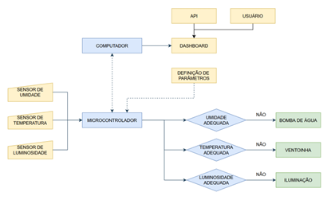
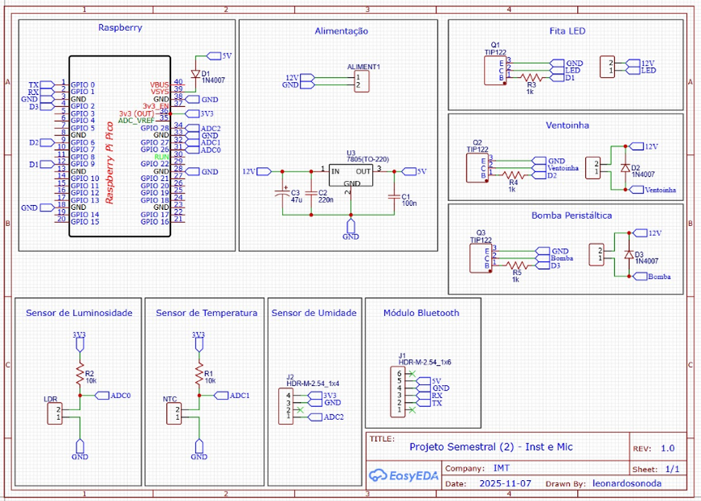
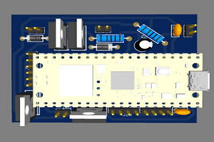
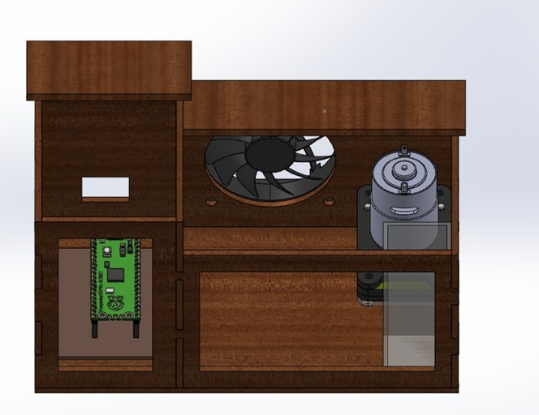
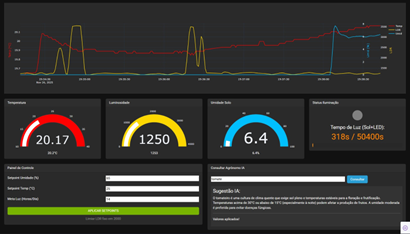
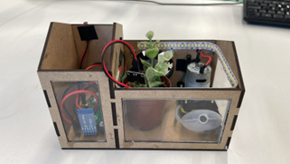

# Smart Greenhouse - IoT Dashboard & Automated Control


## About the Project

This project features a comprehensive **Smart Greenhouse (IoT)** system. It combines custom-built hardware controlled by a Raspberry Pi Pico (RP2040) with a modern, real-time Python dashboard. 

The system autonomously monitors environmental variables (temperature, soil moisture, and luminosity) using analog sensors and a digital moving average filter. Based on user-defined setpoints, it automatically triggers a ventilation fan, a peristaltic water pump, and artificial LED grow lights.

This specific repository focuses on the **Dashboard (HMI - Human-Machine Interface)** built with Python (Dash + Plotly), which communicates with the microcontroller via Serial (Bluetooth/UART), stores historical data, and even integrates with the **Google Gemini AI API** to provide automated agronomic advice based on the plant species.

---

## Key Features

- **Real-Time Telemetry:** Receives 13-byte binary packets via UART from the Pico firmware containing live sensor data.
- **Data Persistence:** Automatically logs readings (timestamp, temperature, humidity, light levels) into a local SQLite database (`minha_estufa.db`).
- **Interactive Dashboard:** Displays dynamic gauges and historical line charts for temperature, soil moisture, luminosity, and photoperiod tracking.
- **Remote Control:** Allows users to send text commands (`SET,TIPO,VALOR`) to the microcontroller to adjust humidity, temperature, LDR thresholds, and daily light goals on the fly.
- **AI Agronomist (Gemini Integration):** Users can input a plant species (e.g., "Tomato") and the dashboard will query the Google Gemini AI to suggest optimal temperature, humidity, and photoperiod settings, automatically applying them to the control panel.
- **Automated Actuators:** The C firmware handles the heavy lifting, using TIP122 transistors to drive a 12V water pump, a 12V fan, and 12V UV LED strips.

---

## Project Gallery

*(Images are located in the `imagens/` directory)*

| Block Diagram | Electrical Schematic |
| :---: | :---: |
|  |  |

| PCB & Prototyping | 3D Enclosure Model |
| :---: | :---: |
|  |  |

| Dashboard Interface | Final Assembled Project |
| :---: | :---: |
|  |  |

---

## Hardware & Components List

- **Microcontroller:** Raspberry Pi Pico (RP2040)
- **Wireless Comm:** HC-05 Bluetooth Module
- **Sensors:**
  - NTC 103 Thermistor (Temperature)
  - LDR Photoresistor (Luminosity)
  - Resistive Soil Moisture Sensor (with voltage divider module)
- **Actuators:**
  - Robocore Peristaltic Pump (12V)
  - Cooling Fan (12V)
  - LED Grow Light Strip (12V)
- **Power & Electronics:**
  - 3x TIP122 Transistors (for switching 12V loads)
  - 3x 1N4007 Diodes (Flyback protection)
  - 1x LM7805 Voltage Regulator (12V to 5V)
  - Capacitors: 100nF & 220nF (Ceramic), 47uF (Electrolytic)
  - Resistors: 2x 10kΩ, 3x 1kΩ

---

## Software Architecture

### 1. The Dashboard (Python)
The `app.py` file contains the main application. It requires Python 3.8+ (3.10+ recommended).

**Dependencies:**
```text
dash
dash-bootstrap-components
plotly
pandas
pyserial
google-generativeai
```

### 2. The Firmware (C / Pico SDK)
The `Estufa.c` file contains the logic flashed onto the RP2040. It uses hardware interrupts and timers to ensure non-blocking execution, applying a 32-sample moving average filter to sensor readings before evaluating logic to trigger the pump, fan, or LEDs.

### 3. Database (SQLite)
The `minha_estufa.db` is created automatically on the first run. The `readings` table stores:
`id` | `timestamp` (ms) | `ldr_raw` | `temperature_c` | `umidade_raw` | `umidade_percent` | `led_status` | `luz_acumulada_s`

---

## How to Run the Dashboard

**1. Create and activate a Virtual Environment (Windows PowerShell):**
```powershell
python -m venv venv
.\venv\Scripts\Activate.ps1
```

**2. Install dependencies:**
```powershell
pip install -r requirements.txt
# OR
pip install dash dash-bootstrap-components plotly pandas pyserial google-generativeai
```

**3. Configure Environment Variables (Optional - For Gemini AI):**
To enable the AI consulting feature, set your Google API Key:
```powershell
$env:GOOGLE_API_KEY = 'your_api_key_here'
```
*(If the key is not set, the dashboard will still work, but the AI feature will be disabled).*

**4. Check Serial Port Configuration:**
Ensure the `COM_PORT` and `BAUD_RATE` inside `app.py` match your Bluetooth/USB connection (Default is `COM12` at `9600` baud).

**5. Run the Application:**
```powershell
python app.py
```
Open your browser and navigate to `http://127.0.0.1:5000`.

*Note: If the serial connection is not found, the dashboard will launch in "View-Only" mode.*

---

## Serial Protocol Overview

The Pico firmware communicates with the Python dashboard via UART using a custom 13-byte binary packet structure for telemetry (sent every second):
- `Byte 0-1`: LDR (uint16)
- `Byte 2-3`: NTC/ADC (uint16)
- `Byte 4-5`: Humidity (uint16)
- `Byte 6`: LED Status (0 or 1)
- `Byte 7-10`: Accumulated Photoperiod Light in seconds (uint32)
- `Byte 11`: Checksum (Sum of bytes 0-10 & 0xFF)
- `Byte 12`: Terminator (`0xAA`)

To update settings, the Python dashboard sends text-based commands to the Pico. Examples:
- `SET,HUMID,3000`
- `SET,TEMP,1600`
- `SET,LDR,2000`
- `SET,META_LUZ,50400`
- `RESET,TIMER_LUZ` (Resets daily light counter)
- `SET,FOTO,1` or `SET,FOTO,0` (Enables/disables photoperiod control)

---

## Troubleshooting

- **No Data / View-Only Mode:** Ensure your Bluetooth module or USB serial is connected to the port specified in `COM_PORT` before starting the script.
- **Invalid Checksum:** Verify that the endianness in `Estufa.c` matches the decoding in `app.py` and that the baud rate is correct.
- **Serial Permission Errors (Windows):** Check your Device Manager to ensure no other program is currently using the COM port.
